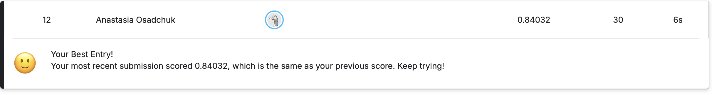

# Задача кластеризации сигналов сцинтилляционного детектора

Целью данной работы является автоматическая кластеризация сигналов со сцинтилляционного детектора на основе органического кристалла паратерфенила. 

Необходимо разделить **23 479** сигналов на три кластера:
- Два кластера соответствуют физическим типам частиц — **гамма-кванты** и **нейтроны**;
- Третий кластер — группа аномальных, шумовых или неидентифицируемых событий.

Задача решается в полностью **unsupervised** режиме (обучение без учителя) с использованием методов машинного обучения и последующей физической интерпретацией полученных кластеров.

### Основной подход
- Проведена предобработка сигналов (коррекция baseline, нормализация).
- Создан набор признаков, описывающих форму импульса (PSD, доли заряда в хвосте, времена нарастания/спада и др.).
- Выполнено сравнение моделей кластеризации (KMeans, Gaussian Mixture).
- Применена двухступенчатая фильтрация для выделения шумового кластера.

**Лучший результат на Kaggle:** **0.84032**

**Ссылка на Google Colab:** [Открыть ноутбук](https://colab.research.google.com/drive/18ZHNpIP7125I-BqMgRsJzfMSHAWclhjN?usp=sharing)
